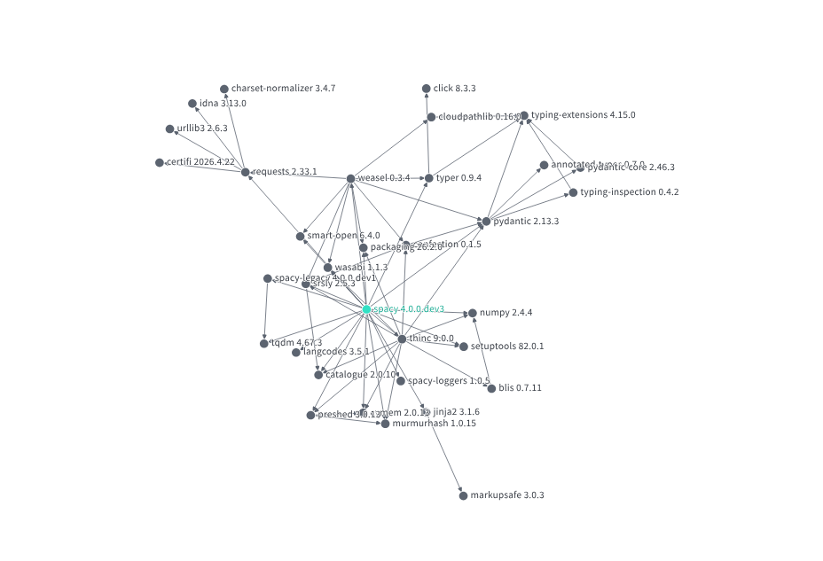

The security of almost all Python applications is closely linked to two key factors:

1. The processes used to develop and maintain them.
2. The dependencies they use.

A fast, simple, and highly effective way to check whether your Python application contains dependencies with known vulnerabilities is to use **Google Open Source Insights**.

:::{tip} 
Use: [Google Open Source Insights](https://deps.dev/)
:::

Open Source Insights is a free service developed and hosted by Google. It helps developers understand the structure, security, and composition of open source software packages. The service analyses each package, builds a complete dependency graph, and makes the detailed results publicly available.

When validating Python projects, the tool provides the following valuable information:

- **OpenSSF Scorecard** (when available) for each project. Note that the Scorecard is not applicable or available for many projects (for example, those that do not run CI/CD workflows on GitHub). The OpenSSF Scorecard provides objective security health metrics for open source projects.

+++

- **All dependencies** — both direct and indirect. You can view them in a clear table format or as an intuitive visual graph. The graph view is particularly useful for quickly understanding which packages introduce additional dependencies.

:::{note} Dependency definition
:class: dropdown

A dependency of a package is a separate piece of software that it imports in order to function. 

There are two main types:

- **Direct dependencies**: packages explicitly declared as required by the project.
- **Indirect (transitive) dependencies**: packages required by one of your direct dependencies (but not explicitly declared by your project).

The full set of dependencies forms a directed acyclic graph (the *dependency graph*). Open Source Insights provides an excellent graph viewer for exploring this.

Other categories, such as test or development dependencies, may also exist.
:::

**Example**: Dependency graph for the [spaCy NLP library](https://github.com/explosion/spacy).
All dependencies (both direct and indirect) are also shown in the Graph below. This gives you a clear picture of how widely a package is used across the Python ecosystem.

+++

- **All dependents** — both direct and indirect are shown for a Python package. You can view them in a clear table format.

:::{note} Dependents definition
:class: dropdown

A *dependent* is the inverse of a dependency. If package P depends on package Q, then P is a dependent of Q.

**Direct dependents** are projects that explicitly import the package. **Indirect (transitive) dependents** arise through chains of dependencies. Packages with many transitive dependents are often critical to the wider ecosystem — any vulnerability or breakage in such a package can have far-reaching impact.
:::

The overview of dependents is especially useful, as it immediately shows how many other PyPI packages rely on a given library.

**Example**: [Dependents of the `click` package (v8.3.3)](https://deps.dev/pypi/click/8.3.3/dependents)

+++

- **Security advisories**, if any exist, are displayed clearly for each package. (Remember that many vulnerabilities are never publicly disclosed.)

:::{important}
Using **Google Open Source Insights** is an essential step when evaluating the security of any Python application or library. 

It should be combined with static application security testing (SAST) by running a tool such as [Python Code Audit](https://github.com/nocomplexity/codeaudit).
:::
